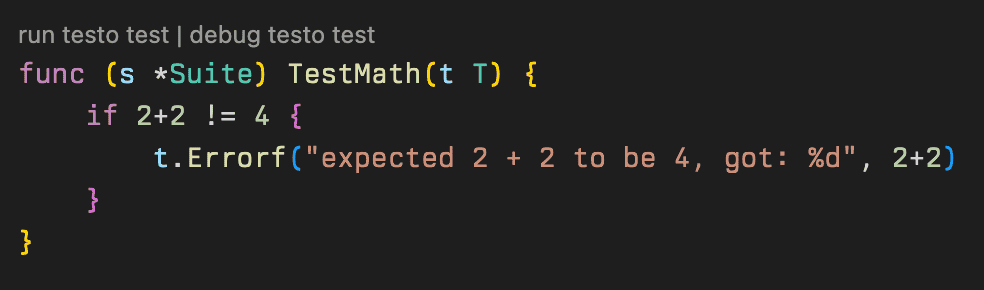

[](https://github.com/ozontech/testo)

# Testo

[](https://pkg.go.dev/github.com/ozontech/testo)
[](https://ozontech.github.io/testo/coverage.html)
[](https://github.com/ozontech/testo/actions/workflows/qa.yml)
[](https://github.com/avelino/awesome-go)

Testo is a modular testing framework for Go built on top of `testing.T`
with an extensive plugin system.

> Testo (/tɛstɒ/) is a play on words "test" and "тесто", meaning "dough".
> Just like you can cook anything from dough, you can test anything with Testo!

See also [toppings](https://github.com/ozontech/testo-toppings) -
a collection of small optional plugins for Testo.

## Features

- [Plugins](./examples/04_plugins/main_test.go) - hook, filter and extend `T` without forking the framework.
- [Parametrized tests](./examples/03_parametrized/main_test.go) - describe a test once, repeat it with different parameters.
- [Parallel tests](./examples/05_parallel/main_test.go) - make your tests faster by running them all at once.
- [Lifecycle hooks](./examples/02_hooks/main_test.go) - before and after any suite, test & sub-test.
- [Test annotations](./examples/07_annotations/main_test.go) - attach static options to any test.
- [Test filtering](./docs/how-to.md#how-to-run-and-skip-specific-tests) - `-run`, `-testo.m`, and the one trap to know before writing CI filters.
- [Informative errors and traces](./examples/06_errors/main_test.go) - error messages name the exact method and type that caused them.
- [Sub-tests & sub-suites](./examples/08_subsuites/main_test.go) - support for nested tests and nested suites.
- [Test reflection](https://pkg.go.dev/github.com/ozontech/testo/testoreflect) - deeply inspect test's meta-information.
- [Caching](./docs/how-to.md#how-to-use-persistent-cache) - key-value storage persistent between test runs.
- [Zero dependencies](./go.mod).

## Why Testo

At Ozon, Testo powers thousands of end-to-end tests daily in production.

Plugins let teams add what they need: reporting, retries, custom `T`
methods. Tests stay plain `go test` tests.

See [comparison with other frameworks](./COMPARISON.md).

## Quick Start

```bash
go get github.com/ozontech/testo
```

Your first test with Testo:

```go
package main

import (
    "testing"

    "github.com/ozontech/testo"
)

func Test(t *testing.T) {
    testo.RunTest(t, func(t *testo.T) {
        t.Log("Hello, Testo!")
    })
}
```

And run it with `go test` as usual:

```bash
go test .
```

Testo also supports suites, parametrized tests & plugins.

### Next steps

- Take [a guided tour of Testo](./docs/tutorial.md) by making simple plugins and running the tests using various features.
- See [test examples](./examples).
- Learn [how to use various Testo features](./docs/how-to.md).
- Migrating from testify or allure-go? See the [migration guide](./docs/migration.md).
- Read a [brief description and technical overview](./docs/technical-overview.md) of Testo.
- View [API documentation](https://pkg.go.dev/github.com/ozontech/testo).

## Plugins

Plugins can:

- Provide `BeforeAll`/`AfterAll`, `BeforeEach`/`AfterEach` & `BeforeEachSub`/`AfterEachSub` hooks.
- Plan tests for execution - filter, duplicate & reorder.
- Override built-in `T` methods, such as `Log`, `Error` and _etc._
- Extend `T` by adding new methods.
- Allow users to configure their behavior through options.
- Communicate with other plugins.
- Add command line flags for `go test` command.

The plugin API (`testoplugin` package) follows the same
[SemVer](https://semver.org) compatibility promise as the rest of the module:
no breaking changes within a major version. New `Spec` fields may be added in minor releases.

Examples:

- [Testo Allure Plugin](https://github.com/ozontech/testo-allure) - enhance your tests with automatically generated [Allure Reports](https://allurereport.org/).
- [Testo Rerun Plugin](https://github.com/ozontech/testo-toppings/tree/main/rerun) - adds `--last-failed`-like behaviour from Pytest to Testo. Makes it possible to rerun only failed tests.
- [Testo XFail Plugin](https://github.com/ozontech/testo-toppings/tree/main/xfail) - adds `t.XFail()` method to mark a test as "expected to fail".
- [Testo Parallel Plugin](https://github.com/ozontech/testo-toppings/tree/main/parallel) - marks all tests as parallel by default.

## VS Code Extension

Testo has its own [VS Code extension](./vscode-extension).

Makes it easier to run and debug individual suite tests and adds helpful snippets.



## Minimum supported Go version

Testo guarantees to support at least **3 latest major** [Go releases](https://go.dev/doc/devel/release).

Currently, minimum supported Go version is **1.24**

## Contributing

Contributions are welcome!

See [contributing guidelines](./CONTRIBUTING.md).

## License

This project is released under the [Apache-2.0 license](./LICENSE).
